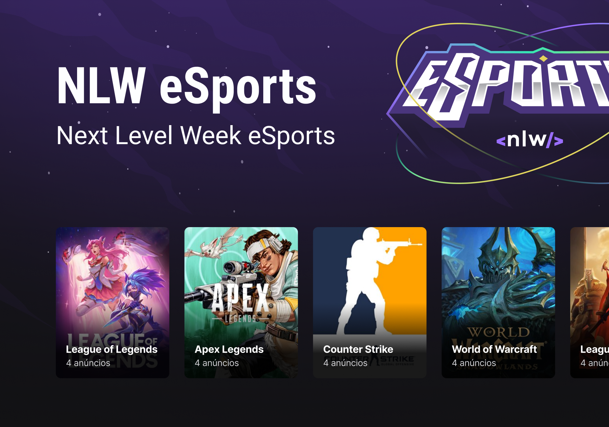

  Next Level Week - eSports Edition

  

## 💻 Projeto

Um projeto feito encontrar pessoas para jogar seus jogos favoritos com você

## ✨ Tecnologia

- [React](https://react.dev/)
- [JavaScript](https://www.javascript.com/)
- [TypeScript](https://www.typescriptlang.org/)

## 🔖 Layout

Você pode visualizar o layout do projeto através do link abaixo:

- [Layout](<https://www.figma.com/file/IcB3GieAJn47WwxFb3Vkvx/NLW-eSports-(Community)-(Copy)?type=design&node-id=6-23&mode=design&t=rQ6AzwtEZFD7yU6y-0>)

Lembrando que você precisa ter uma conta no [Figma](http://figma.com/).

## 📝 License

Esse projeto está sob a licença MIT. Veja o arquivo [LICENSE](LICENSE) para mais detalhes.

---

  Feito com 💜 by Rocketseat

  <a href="https://discord.gg/rocketseat">👉 Participe da nossa comunidade 👈</a>

### Desafios criados e concluídos

- [x] - Componentizar de forma atômica
- [x] - Criar estrutura modular
- [x] - Clean code e single responsability
- [x] - Usar constante para lista de dias
- [x] - Criação de services para comunicações HTTP

### Desafios propostos pelo Diego Fernandez

- [ ] - Responsividade
- [ ] - Carroseul (keen-slider)
- [x] - Usar Radix para component de Select
- [ ] - Validação do formulário (React hook form)
- [ ] - Autenticação com Discord